# iCalSched 软件架构图

## 1. 系统整体架构

### 1.1 分层架构图

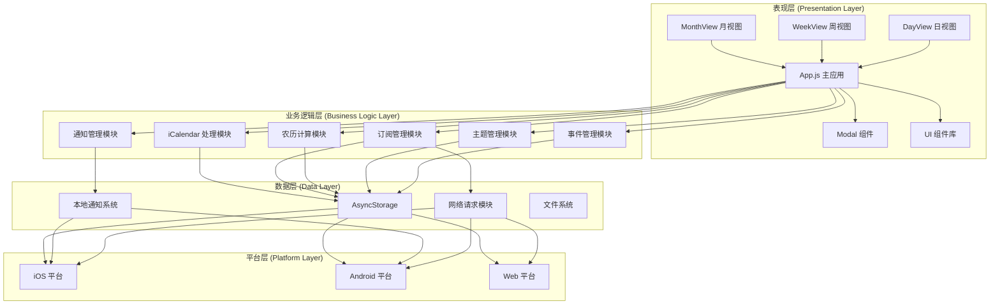

### 1.2 系统组件关系图

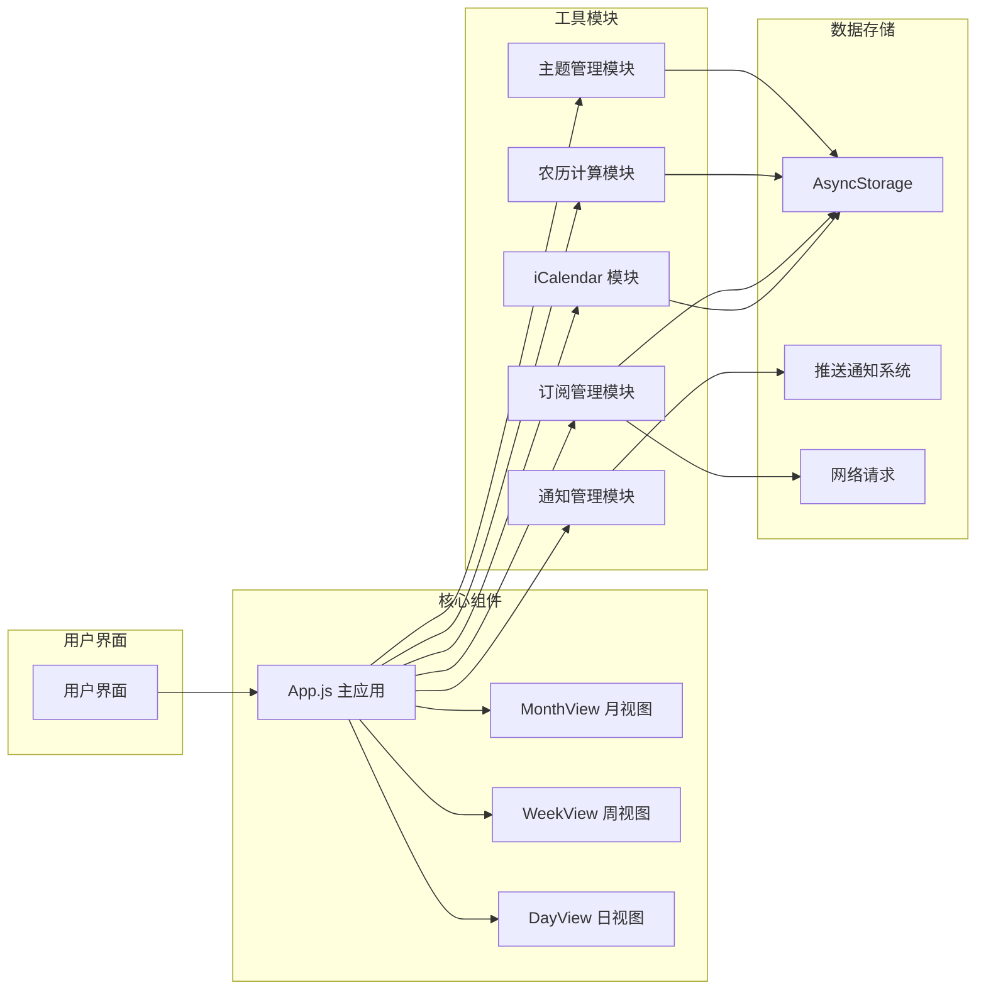

## 2. 核心模块架构

### 2.1 主应用模块架构

```mermaid
graph TB
    subgraph "App.js 主应用"
        A[状态管理 State]
        B[事件处理 Handlers]
        C[模态框管理 Modals]
        D[视图切换 View Switching]
        E[通知集成 Notification Integration]
    end
    
    subgraph "状态管理"
        A1[events 事件列表]
        A2[subscriptions 订阅列表]
        A3[currentTheme 当前主题]
        A4[viewType 视图类型]
        A5[selectedDate 选中日期]
    end
    
    subgraph "事件处理"
        B1[handleSaveEvent 保存事件]
        B2[handleDeleteEvent 删除事件]
        B3[addSubscription 添加订阅]
        B4[removeSubscription 移除订阅]
        B5[handleThemeChange 切换主题]
    end
    
    subgraph "模态框管理"
        C1[事件编辑模态框]
        C2[订阅管理模态框]
        C3[主题选择模态框]
        C4[月份选择模态框]
    end
    
    subgraph "视图切换"
        D1[月视图 MonthView]
        D2[周视图 WeekView]
        D3[日视图 DayView]
    end
    
    subgraph "通知集成"
        E1[初始化通知]
        E2[调度通知]
        E3[取消通知]
        E4[测试通知]
    end
    
    A --> A1
    A --> A2
    A --> A3
    A --> A4
    A --> A5
    B --> B1
    B --> B2
    B --> B3
    B --> B4
    B --> B5
    C --> C1
    C --> C2
    C --> C3
    C --> C4
    D --> D1
    D --> D2
    D --> D3
    E --> E1
    E --> E2
    E --> E3
    E --> E4
```

### 2.2 iCalendar 模块架构

```mermaid
graph TB
    subgraph "iCalendar 模块"
        A[事件创建]
        B[事件解析]
        C[事件导出]
        D[重复规则]
        E[提醒管理]
    end
    
    subgraph "事件创建"
        A1[createVEvent]
        A2[updateVEvent]
        A3[deleteVEvent]
    end
    
    subgraph "事件解析"
        B1[parseICalendar]
        B2[parseICalDateTime]
        B3[parseRRule]
    end
    
    subgraph "事件导出"
        C1[exportToICalendar]
        C2[formatICalDate]
        C3[formatICalDateTime]
    end
    
    subgraph "重复规则"
        D1[buildRRule]
        D2[parseRRule]
        D3[getRRuleDescription]
    end
    
    subgraph "提醒管理"
        E1[createVAlarm]
        E2[getAlarmDescription]
        E3[parseTriggerToMinutes]
    end
    
    A --> A1
    A --> A2
    A --> A3
    B --> B1
    B --> B2
    B --> B3
    C --> C1
    C --> C2
    C --> C3
    D --> D1
    D --> D2
    D --> D3
    E --> E1
    E --> E2
    E --> E3
```

### 2.3 订阅管理模块架构

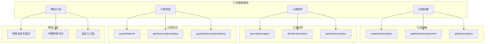

### 2.4 通知管理模块架构

```mermaid
graph TB
    subgraph "通知管理模块"
        A[初始化]
        B[权限管理]
        C[通知调度]
        D[通知取消]
    end
    
    subgraph "初始化"
        A1[initializeNotifications]
        A2[配置通知渠道]
        A3[设置通知类型]
    end
    
    subgraph "权限管理"
        B1[requestNotificationPermissions]
        B2[checkNotificationPermissions]
        B3[handlePermissionResult]
    end
    
    subgraph "通知调度"
        C1[scheduleEventNotifications]
        C2[createNotification]
        C3[setNotificationTime]
    end
    
    subgraph "通知取消"
        D1[cancelEventNotifications]
        D2[cancelAllNotifications]
        D3[clearNotificationSchedule]
    end
    
    A --> A1
    A --> A2
    A --> A3
    B --> B1
    B --> B2
    B --> B3
    C --> C1
    C --> C2
    C --> C3
    D --> D1
    D --> D2
    D --> D3
```

## 3. 数据流架构

### 3.1 事件创建数据流

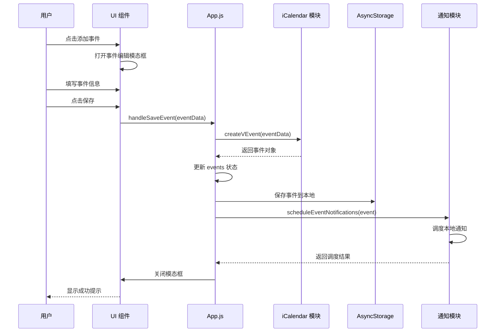

### 3.2 订阅同步数据流

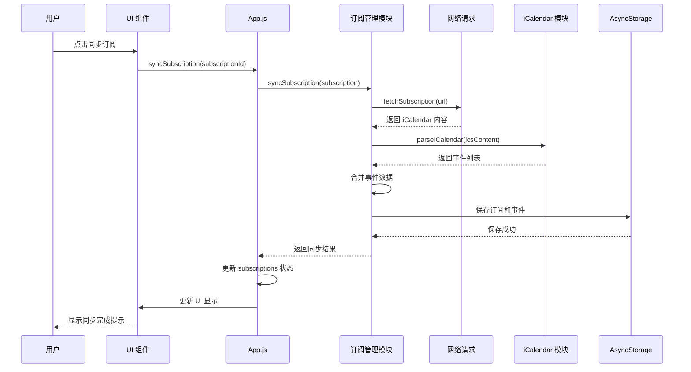

### 3.3 通知调度数据流

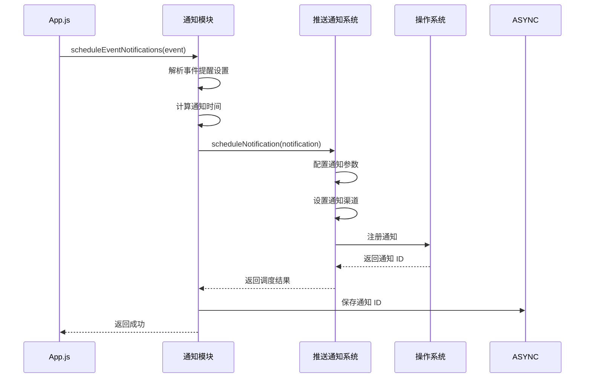

## 4. 组件交互架构

### 4.1 视图切换流程

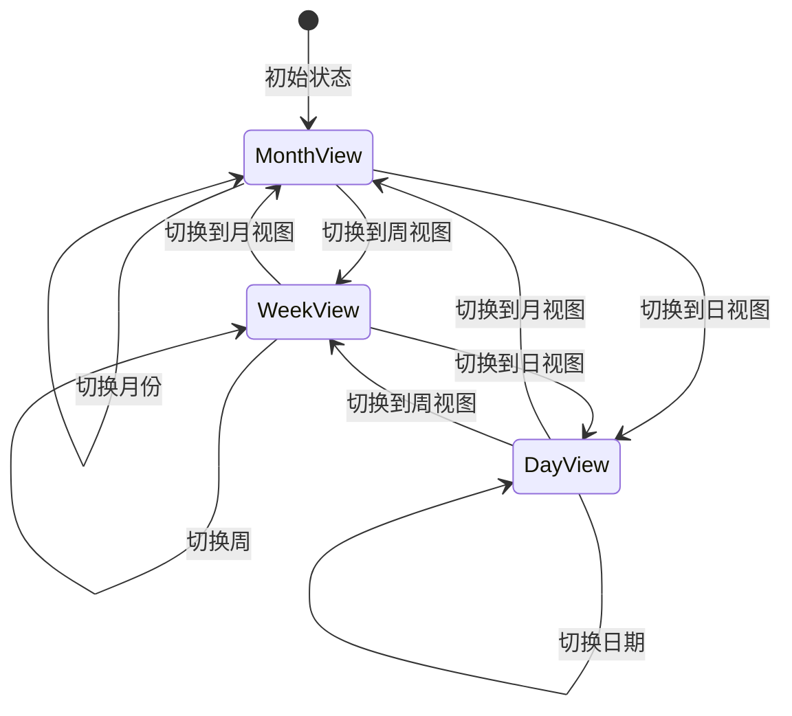

### 4.2 事件生命周期

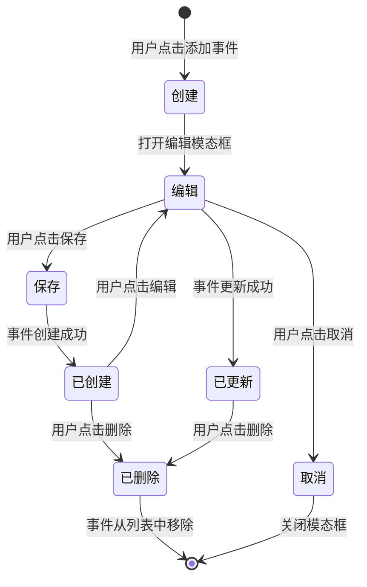

### 4.3 订阅生命周期

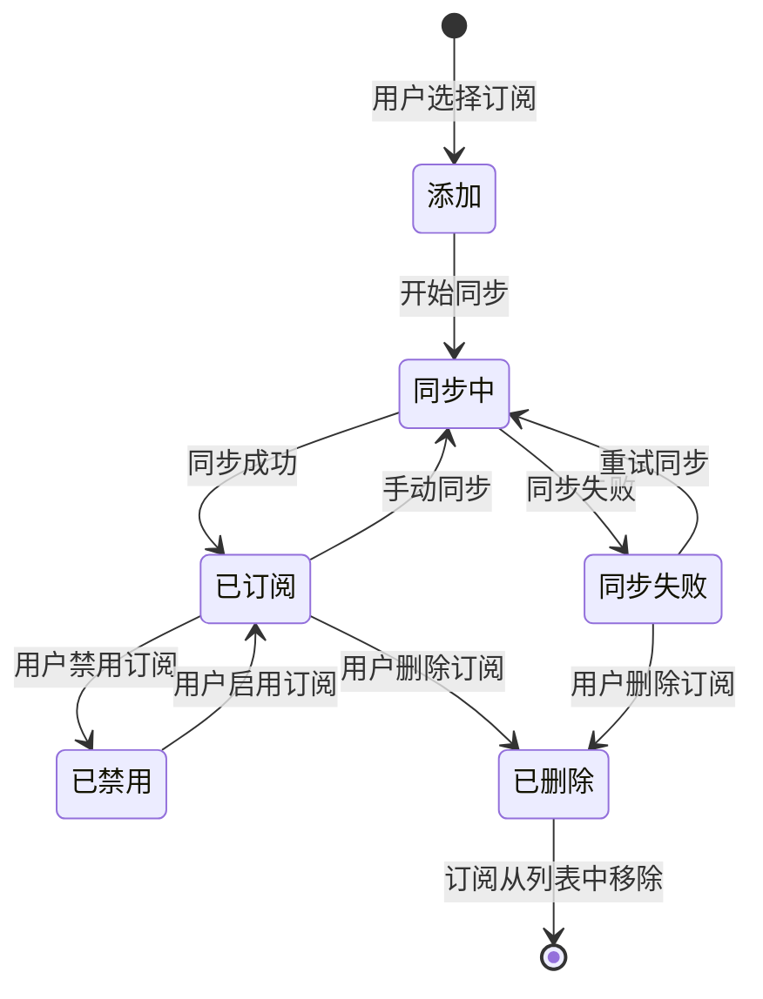

## 5. 技术架构

### 5.1 技术栈架构

```mermaid
graph TB
    subgraph "前端框架"
        A1[React Native 0.74.5]
        A2[Expo SDK 51]
    end
    
    subgraph "状态管理"
        B1[React Hooks]
        B2[useState]
        B3[useEffect]
    end
    
    subgraph "数据持久化"
        C1[AsyncStorage]
        C2[本地文件系统]
    end
    
    subgraph "通知系统"
        D1[react-native-push-notification]
        D2[@react-native-community/push-notification-ios]
    end
    
    subgraph "UI 组件"
        E1[React Native 核心]
        E2[lucide-react-native]
    end
    
    subgraph "构建工具"
        F1[Expo EAS Build]
        F2[Gradle]
        F3[Xcode]
    end
    
    subgraph "开发工具"
        G1[Babel]
        G2[ESLint]
        G3[VS Code]
    end
    
    A1 --> B1
    A2 --> B1
    B1 --> C1
    B1 --> D1
    A1 --> E1
    A1 --> E2
    A2 --> F1
    F1 --> F2
    F1 --> F3
    G1 --> A1
    G2 --> A1
```

### 5.2 平台适配架构

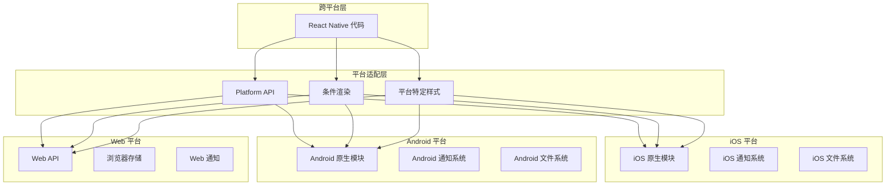

## 6. 部署架构

### 6.1 构建流程架构

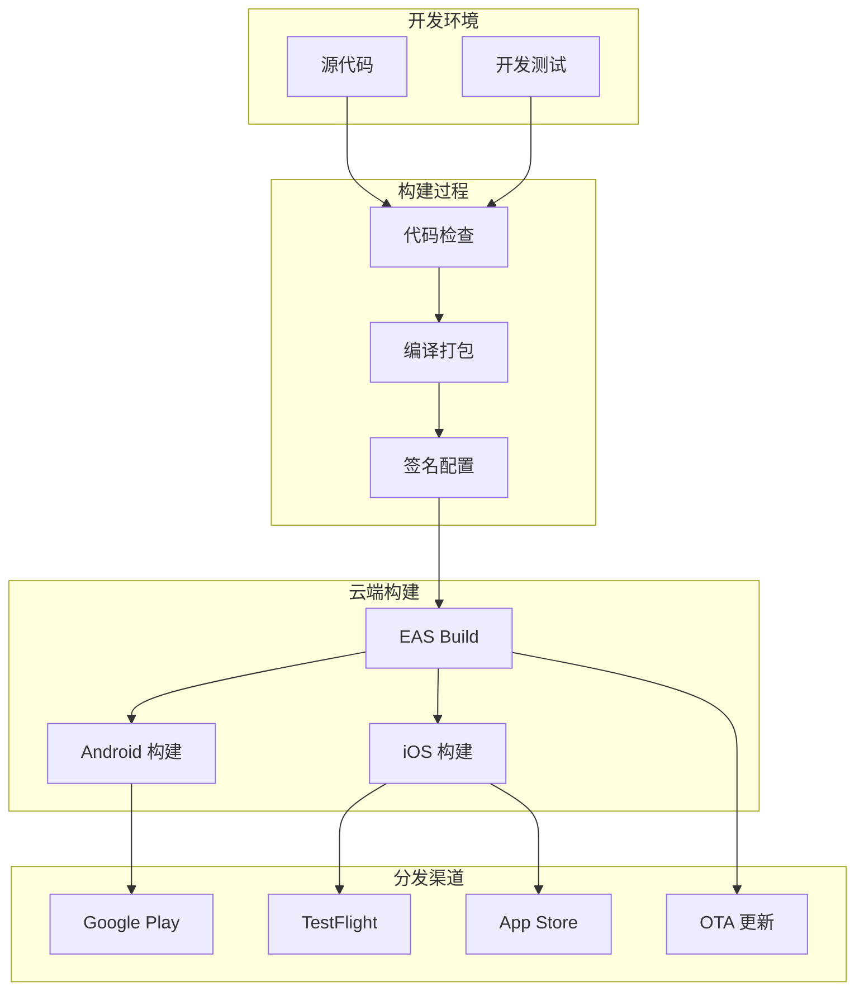

### 6.2 运行时架构

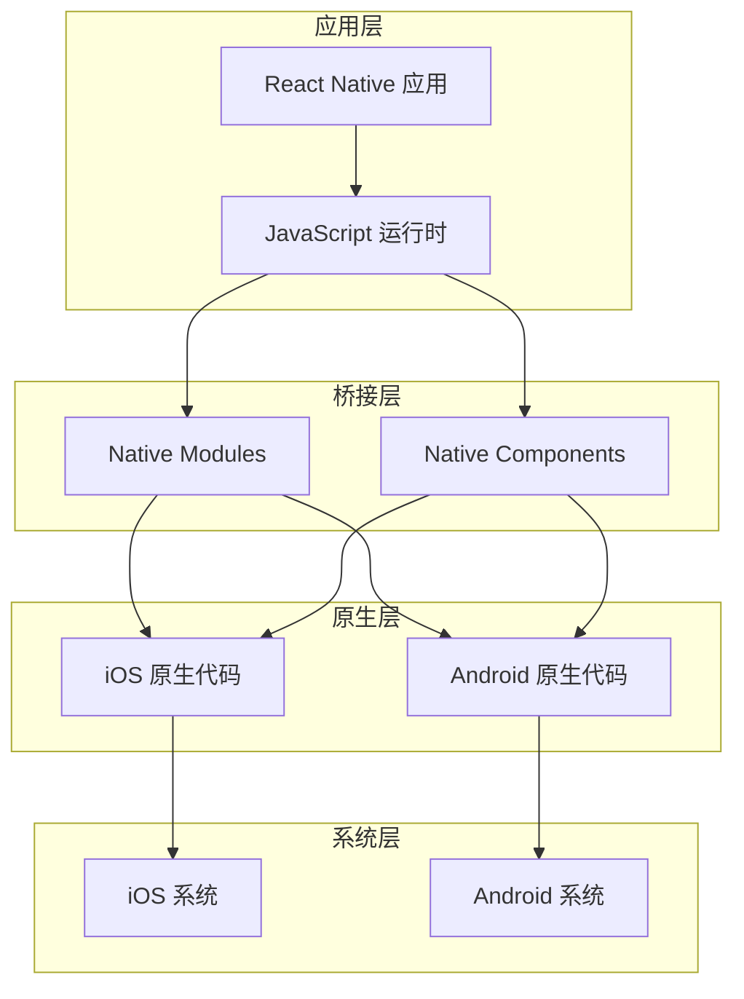

## 7. 数据存储架构

### 7.1 本地存储架构

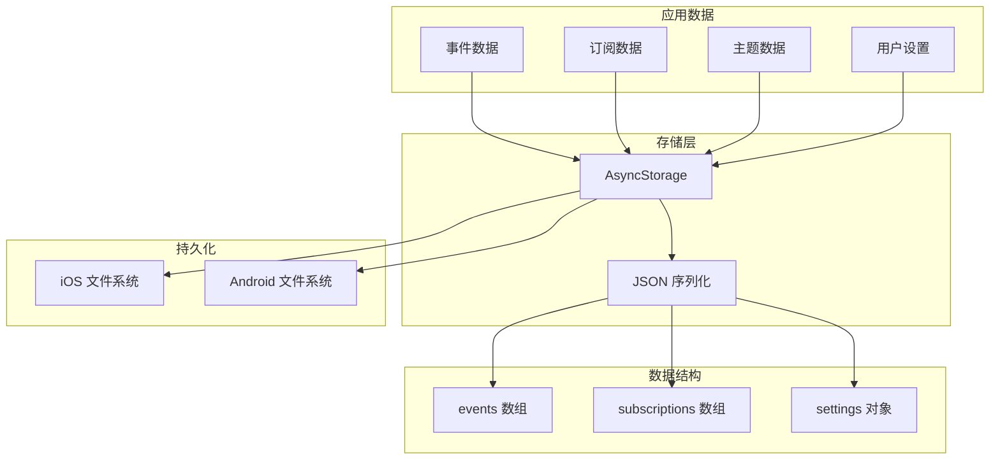

### 7.2 数据同步架构

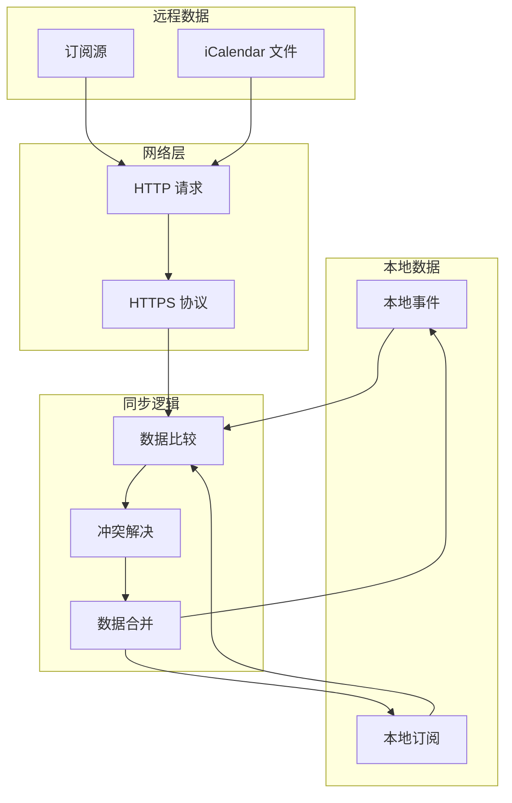

## 8. 安全架构

### 8.1 数据安全架构

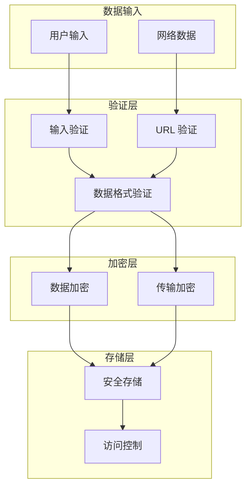

### 8.2 权限管理架构

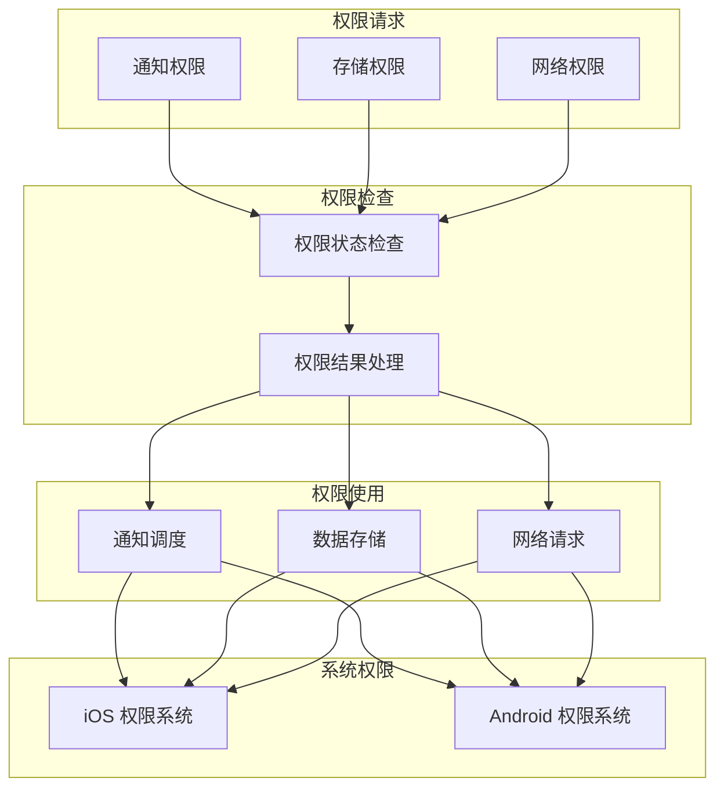

## 9. 性能优化架构

### 9.1 渲染优化架构

```mermaid
graph TB
    subgraph "组件层"
        A1[React.memo]
        A2[useMemo]
        A3[useCallback]
    end
    
    subgraph "列表优化"
        B1[FlatList]
        B2[虚拟化列表]
        B3[分页加载]
    end
    
    subgraph "动画优化"
        C1[Animated API]
        C2[原生驱动动画]
        C3[硬件加速]
    end
    
    subgraph "性能监控"
        D1[性能分析]
        D2[帧率监控]
        D3[内存监控]
    end
    
    A1 --> B1
    A2 --> B1
    A3 --> B1
    B1 --> B2
    B2 --> B3
    C1 --> C2
    C2 --> C3
    D1 --> A1
    D2 --> C1
    D3 --> B1
```

### 9.2 数据优化架构

```mermaid
graph TB
    subgraph "数据缓存"
        A1[内存缓存]
        A2[磁盘缓存]
        A3[订阅缓存]
    end
    
    subgraph "请求优化"
        B1[防抖]
        B2[节流]
        B3[请求合并]
    end
    
    subgraph "数据压缩"
        C1[Gzip 压缩]
        C2[数据精简]
        C3[增量更新]
    end
    
    subgraph "性能提升"
        D1[加载速度]
        D2[响应速度]
        D3[用户体验]
    end
    
    A1 --> B1
    A2 --> B2
    A3 --> B3
    B1 --> C1
    B2 --> C2
    B3 --> C3
    C1 --> D1
    C2 --> D2
    C3 --> D3
```

## 10. 扩展性架构

### 10.1 模块扩展架构

```mermaid
graph TB
    subgraph "核心模块"
        A1[事件管理]
        A2[订阅管理]
        A3[通知管理]
    end
    
    subgraph "扩展接口"
        B1[插件接口]
        B2[主题接口]
        B3[数据源接口]
    end
    
    subgraph "扩展模块"
        C1[自定义插件]
        C2[自定义主题]
        C3[自定义数据源]
    end
    
    subgraph "配置管理"
        D1[插件配置]
        D2[主题配置]
        D3[数据源配置]
    end
    
    A1 --> B1
    A2 --> B2
    A3 --> B3
    B1 --> C1
    B2 --> C2
    B3 --> C3
    C1 --> D1
    C2 --> D2
    C3 --> D3
```

### 10.2 平台扩展架构

```mermaid
graph TB
    subgraph "现有平台"
        A1[iOS 平台]
        A2[Android 平台]
        A3[Web 平台]
    end
    
    subgraph "平台适配"
        B1[平台检测]
        B2[平台特定代码]
        B3[平台样式]
    end
    
    subgraph "新平台"
        C1[Windows 平台]
        C2[macOS 平台]
        C3[Linux 平台]
    end
    
    subgraph "扩展支持"
        D1[原生模块]
        D2[平台 API]
        D3[构建配置]
    end
    
    A1 --> B1
    A2 --> B1
    A3 --> B1
    B1 --> B2
    B2 --> B3
    C1 --> D1
    C2 --> D1
    C3 --> D1
    D1 --> D2
    D2 --> D3
```

---

**文档版本**：1.0  
**最后更新**：2026-01-13  
**维护者**：iCalSched Team
